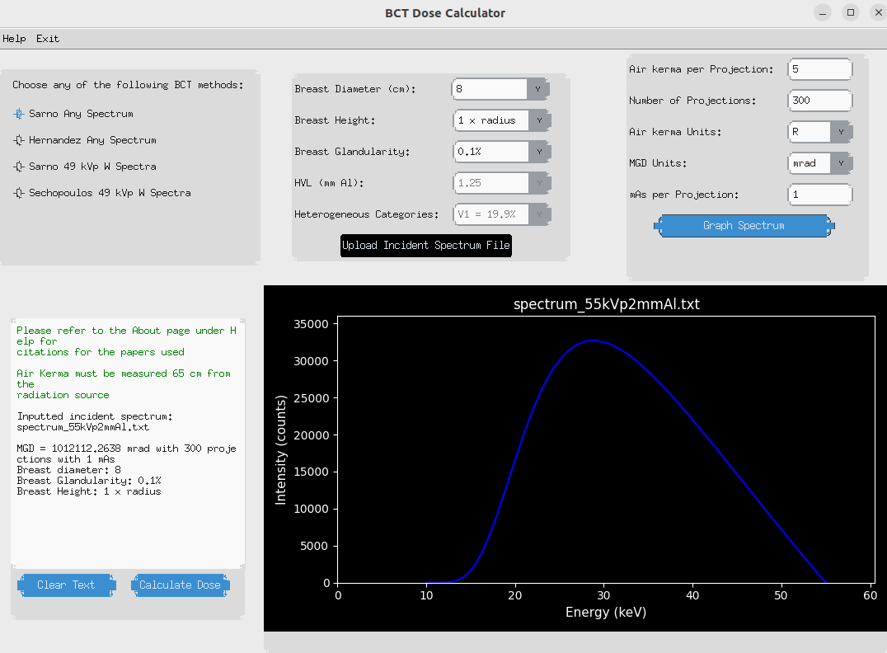

GUI Overview 
============

The Python GUI runs on Windows, Mac, and Linux. All inputs and buttons are shown in the screenshots of the interface below. 

Figure 1: Screen captures of PyBDC program. The image shows example inputs used by the GUI to compute the mean glandular dose. The provided example is for the Sarno method with an incident spectrum measured at 55 kVp, with 2 mm of aluminum filtration. The incident spectrum is also plotted in the figure. 

Data Files 
==========
The program requires several data files found within the program directory. These data files consist of the dose tables necessary for dose calculations and a python file to read the text files and convert them to a pandas data frame which can be easily accessed. The following are the necessary data files:

Dose tables:

* Hernandez_heterogeneous_dgn

* Sarno_mono_dgn

* Sarno_poly_dgn

* Sechopoulos_dgn

The Hernandez heterogeneous text file contains columns for the photon energy values, and the different volume glandular fractions (V1, V3, and V5). The coefficients range are in units of mGy/mGy and range from 9 to 70 keV with a step size of 1. 

The Sarno monoergentic DgN text file contains columns for the different breast diameters, the glandularity, and the breast height value. The DgN coefficients are in units of mGy/mGy. Lastly, the Sarno polyenergetic DgN text file contains columns for the HVL lengths, the different breast diameters, the glandularity, and the breast heights.

The Sechopoulos DgN text file contains a column for the breast diameter, breast length, and the different glandularities. The coefficients are in units of mGy/mGy.
 
Python file for dose equations:
dose_equations.py

This file simply reads the different tables mentioned above and converts them into a pandas data frame. The file further contains the necessary equations for calculating mean glandular dose values.

